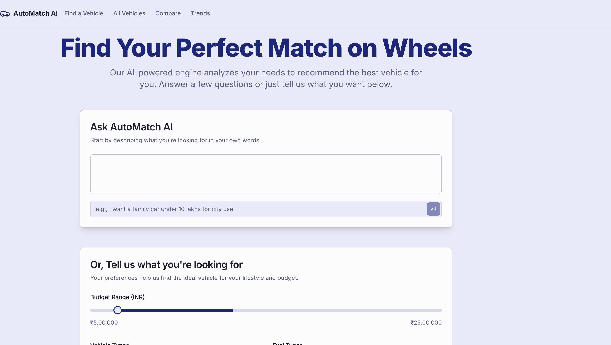
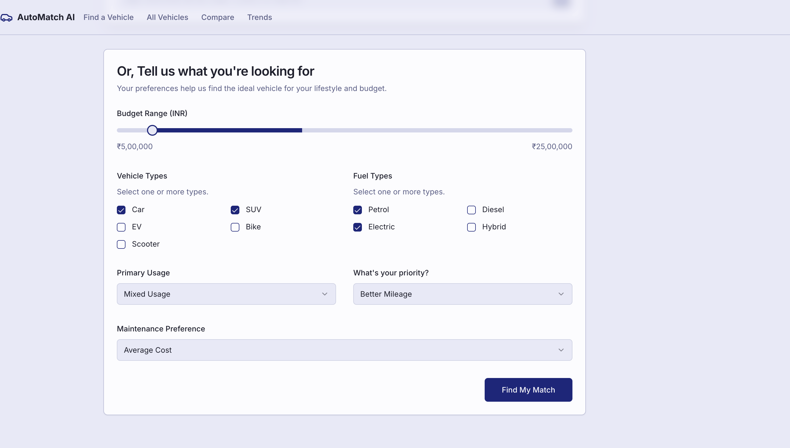
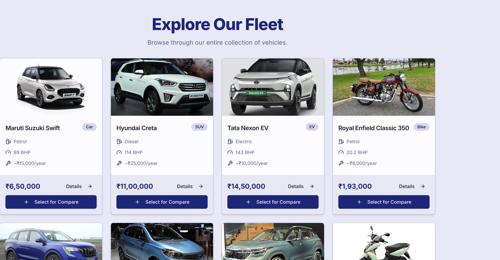
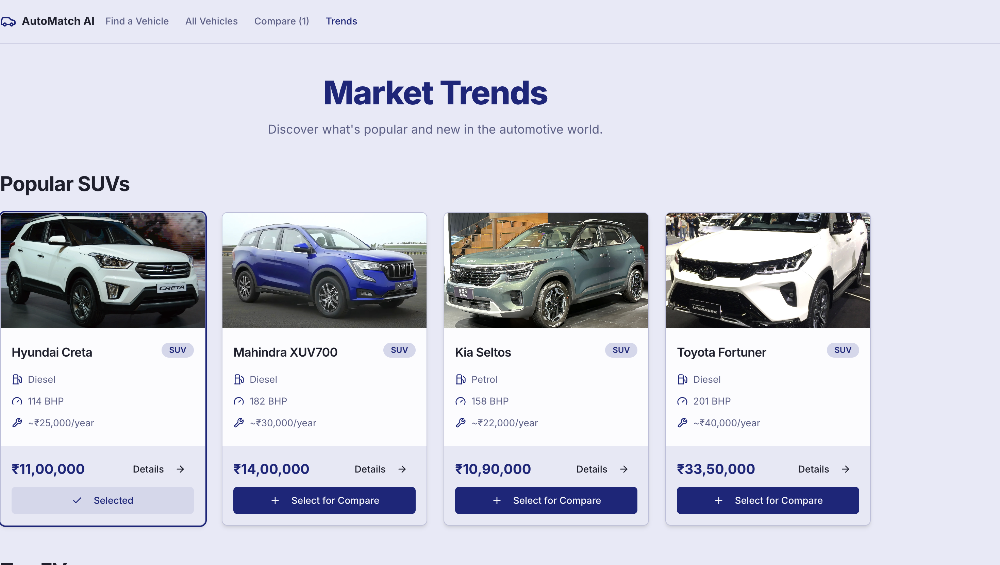

# 🚗 VehicleWise AI

AutoMatch AI is an intelligent matching system that uses AI to analyze inputs and generate optimal matches based on similarity, relevance, and context. It combines a modern web interface with AI-driven logic to provide accurate recommendations, comparisons, and insights.

🔗 *Live Demo:* https://vehiclewise-ai.vercel.app  

---

## 📌 Project Overview

VehicleWise AI is a smart recommendation platform designed to simplify vehicle selection.  
The application uses modern web technologies to provide a fast, responsive, and user-friendly experience.

This project demonstrates:

- Frontend development skills
- Deployment knowledge
- Git & GitHub workflow
- Production hosting with Vercel
- Clean UI design principles

---
##Features
Intelligent Matching: Matches items, users, or preferences using AI-driven algorithms.
User-Friendly UI: Clean and responsive interface built with Next.js and Tailwind CSS.
Comparison Tool: Easily compare results side by side to find the best match.
Explore & Trends: Visualize trending matches and recommendations.
Scalable Architecture: Ready for future integration with advanced ML models or databases.

## 🛠 Tech Stack

Frontend: React.js + Next.js
Styling: Tailwind CSS
Machine Learning: AI matching engine (similarity & relevance-based algorithms)
Deployment: Vercel (for live demos)
Version Control: Git & GitHub

## Project Structure
AutoMatch-AI/
├─ docs/                # Documentation and screenshots
├─ src/                 # Source code (frontend components, pages)
├─ public/              # Static assets like images
├─ package.json         # Node.js dependencies and scripts
├─ next.config.ts       # Next.js configuration
├─ tailwind.config.ts   # Tailwind CSS setup
├─ postcss.config.mjs   # PostCSS setup
└─ README.md            # Project overview

## 📷 Screenshots

### 🏠 Homepage

### 🎯 Hero Section

### 🔍 Options Page

### 📊 Comparison Page

### 📝 Results Page

